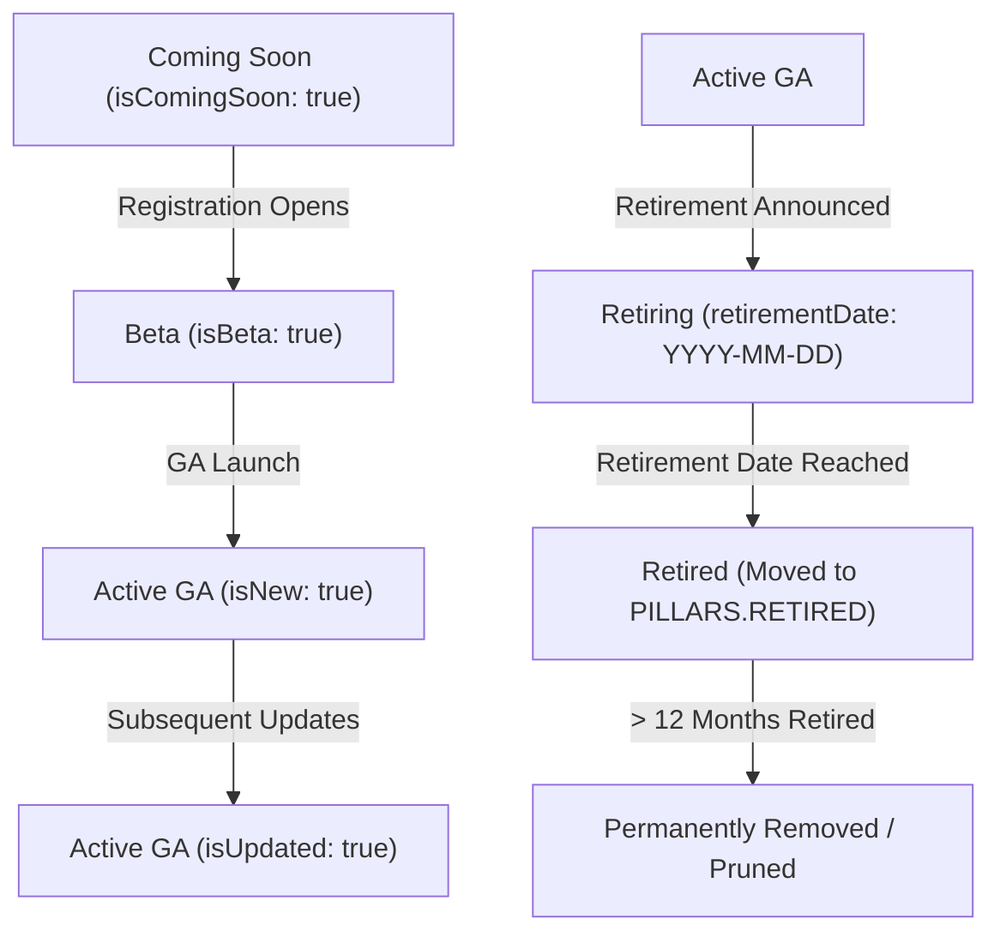
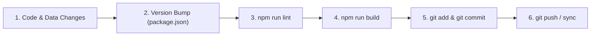

# Antigravity Agent Guidelines & Rules

This document governs the architecture, data structures, design standards, lifecycle management, and development workflows for the **Microsoft Certification Tracker & Career Roadmap Tool** (`atozazure-mscertification-tool`). All automated agents and contributors must strictly adhere to these instructions.

---

## Table of Contents
1. [Project Overview & Core Technology Stack](#1-project-overview--core-technology-stack)
2. [Data Model, Schemas & Central Helpers](#2-data-model-schemas--central-helpers)
3. [Certification Lifecycle & Intelligence Management](#3-certification-lifecycle--intelligence-management)
4. [UI Design System & Component Standards (Fluent 2)](#4-ui-design-system--component-standards-fluent-2)
5. [Application State, Persistence & Multi-Currency](#5-application-state-persistence--multi-currency)
6. [Interactive Features, Graph Layouts & Routing](#6-interactive-features-graph-layouts--routing)
7. [Git Workflows & Pre-Commit Quality Gate](#7-git-workflows--pre-commit-quality-gate)

---

## 1. Project Overview & Core Technology Stack

- **Framework & Build**: React 18+ with Vite.
- **Styling Architecture**: Vanilla CSS with BEM methodology (strictly **no Tailwind CSS**).
- **Design Language**: Microsoft Fluent 2 Design System tokens, typography, and dark/light themes.
- **Graph Layout & Visualization**: React Flow paired with the Dagre graph layout engine.
- **Drag-and-Drop**: `@dnd-kit/core` and `@dnd-kit/sortable`.
- **Icons**: Centralized abstraction via `@fluentui/react-icons` and custom SVG product icons.
- **Key Directory Structure**:
  - `src/data/`: Static sources of truth (`certificationPaths.js`, `careerRoles.js`).
  - `src/components/`: Modular UI components organized by domain (`Dashboard/`, `PathMap/`, `CareerPathBuilder/`, `CertDetail/`, `Layout/`, `common/`).
  - `src/context/`: React Context providers (`ProgressContext`, `ThemeContext`, `CurrencyContext`, `ToastContext`).
  - `src/hooks/`: Custom state hooks (`useProgress.js`).
  - `src/utils/`: Shared utilities, badge resolvers, date formatters, and pricing engines (`helpers.js`, `pricing.js`).

---

## 2. Data Model, Schemas & Central Helpers

All certification and career path data reside in `src/data/certificationPaths.js` and `src/data/careerRoles.js`.

### 2.1 Pillars Enum (`PILLARS`)
```javascript
export const PILLARS = {
  CLOUD_AI: 'Cloud & AI Platforms',
  BIZ_SOLUTIONS: 'AI Business Solutions',
  SECURITY: 'Security',
  RETIRED: 'Retired & Archived',
};
```

### 2.2 Path Track Schema (`src/data/certificationPaths.js`)
Each track object represents an exam category or domain:
| Field | Type | Description |
|---|---|---|
| `id` | `string` (kebab-case) | Unique track identifier (e.g. `'azure-infrastructure'`, `'security'`). |
| `name` | `string` | Full path track title. |
| `shortName` | `string` | Compact title used in badges and navigation cards. |
| `code` | `string` | Uppercase 2-letter prefix (e.g. `'AZ'`, `'SC'`, `'AI'`). |
| `pillar` | `PILLARS.*` | Pillar category mapping. |
| `color` | `string` | CSS variable for path line (e.g. `'var(--line-azure)'`). |
| `glowColor` | `string` | CSS variable for path glow highlight. |
| `cssVar` | `string` | Raw CSS variable name without `var()`. |
| `icon` | `string` | Key mapped in `src/components/common/IconMap.jsx`. |
| `description` | `string` | Concise overview of the track scope. |
| `branches` | `Array<Object>` | Array of branch tracks: `[{ id: 'admin', name: 'Admin', description: '...' }]`. |
| `certifications`| `Array<Object>` | List of certification objects belonging to this path track. |

### 2.3 Certification Object Schema (`src/data/certificationPaths.js`)
#### Mandatory Fields:
- `id`: Lowercase kebab-case string matching the exam ID (e.g. `'az-104'`, `'ai-102'`).
- `examCode`: Uppercase official exam code string (e.g. `'AZ-104'`, `'AI-102'`).
- `name`: Full certification credential title (e.g. `'Azure Administrator Associate'`).
- `level`: One of `CERT_LEVELS` (`'Fundamentals'`, `'Associate'`, `'Expert'`, `'Specialty'`).
- `description`: Comprehensive summary of the certification scope and target persona.
- `prerequisites`: Array of prerequisite cert IDs (e.g. `['az-104']`) OR nested arrays for "1 of N" choice requirements (e.g. `[['az-104', 'az-204']]`). Use `[]` if none.
- `learnUrl`: Verified, active Microsoft Learn exam page URL.
- `retirementDate`: `'YYYY-MM-DD'` string if announced, otherwise `null`.
- `skillsMeasured`: Array of strings detailing objective domains and percentage weightings.

#### Optional Fields:
- `recommendedPrereqs`: Array of cert IDs (e.g. `['az-900']`) recommended for foundational learning but not strictly required.
- `branch`: Lowercase string matching one of the parent path's `branches[].id` values.
- `isBeta`: `true` or `'Beta from <Month> <Year>'` (e.g. `'Beta from July 2026'`).
- `isNew`: `true` (renders `<Badge variant="new">New</Badge>`).
- `isUpdated`: `true` (renders `<Badge variant="updated">Updated</Badge>`).
- `isComingSoon`: `true` (renders `<Badge variant="default">Coming soon</Badge>`).
- `isIndependent`: `true` (marks standalone, disconnected, or retired certs in Dagre/React Flow graph layout).

> [!IMPORTANT]
> **Dynamic Runtime Properties**: Do **NOT** hardcode `role`, `roles`, or `roleData` on certification objects in `certificationPaths.js`. These are computed and attached automatically at runtime by matching against `src/data/careerRoles.js`.

### 2.4 Career Roles Schema (`src/data/careerRoles.js`)
Each role object defines a job profile:
- `id`: Lowercase kebab-case string (e.g. `'ai-engineer'`, `'solutions-architect'`).
- `title`: Display name of the career role.
- `description`: Role responsibilities summary.
- `icon`: Key mapped in `IconMap.jsx`.
- `color`: CSS variable for role theme accent.
- `certs`: Array of valid certification IDs mapped to this career role.

> [!WARNING]
> **Data Synchronization Requirement**: Whenever a certification ID is added, renamed, or retired in `certificationPaths.js`, you **must** review `src/data/careerRoles.js` to ensure the `certs: [...]` arrays contain no dangling or broken IDs.

### 2.5 Central Data Helpers (`certificationPaths.js`)
Always leverage existing central helper functions:
- `getCertById(id)`: Returns `{ cert, path }` or `null`.
- `getAllCertifications()`: Returns a flattened array of all certifications with path metadata.
- `getPathById(pathId)`: Returns the track object or `undefined`.
- `getCertificationsRequiring(certId)`: Returns array of certifications listing `certId` as a prerequisite.
- `doesCertExpire(level)`: Returns boolean indicating if the level requires annual renewal (`Associate`, `Expert`, `Specialty`).

---

## 3. Certification Lifecycle & Intelligence Management

### 3.1 Primary Information Source
- When researching, adding, or modifying Microsoft certifications, the **official primary source of truth** is the Microsoft Tech Community Skills Hub:
  **https://techcommunity.microsoft.com/category/skills-hub/blog/skills-hub-blog**

### 3.2 State Transitions & Attribute Management


1. **Coming Soon Certifications**:
   - Set `isComingSoon: true` for newly announced certifications prior to registration or beta availability.
2. **Transition to Beta**:
   - When registration opens, remove `isComingSoon` and set `isBeta: true` or `isBeta: 'Beta from Month YYYY'`.
3. **Transition from Beta to GA**:
   - When an exam transitions from Beta to GA, remove `isBeta` and add `isNew: true`.
4. **New & Updated Certifications (Rule of Recency)**:
   - **New Certifications**: When a new certification is added, set `isNew: true`.
   - **Updated Certifications**: When an existing certification is modified (e.g. skills measured, title, requirements), set `isUpdated: true`.
   - **Rule of Recency**: Whenever certification additions or updates are applied, actively scan `src/data/certificationPaths.js` and remove any previous `isNew: true` or `isUpdated: true` flags from older certifications so only the most recently added or modified credentials are highlighted.
5. **Retiring Certifications**:
   - When Microsoft announces an exam retirement, add `retirementDate: 'YYYY-MM-DD'` and display the `"Retiring"` badge.
   - The certification remains in its active pillar path while retiring.
6. **Retired Certifications & Prerequisite Succession**:
   - When an exam passes its retirement date, move the certification entry to `PILLARS.RETIRED` under the retired track (`id: 'retired'`) in `src/data/certificationPaths.js`.
   - Set its `branch: 'retired'` and `isIndependent: true`.
   - Update `src/data/careerRoles.js` to remove or replace the retired exam ID.
   - **Prerequisite Succession**: Check all active certifications that listed the retired exam in their `prerequisites` array and update them to point to the official successor certification (e.g. replacing `dp-203` with `dp-700`).
7. **Automated Pruning of Long-Retired Certifications (>12 Months)**:
   - When a certification has been retired for **more than 12 months** (i.e. `retirementDate` is more than 1 year in the past from the current date), automatically and permanently remove the certification entry from `PILLARS.RETIRED` in `src/data/certificationPaths.js`.
   - Clean up any residual references in `src/data/careerRoles.js` and badge mappings to keep the application lean and free of stale, obsolete exam data.

### 3.3 Certification Expiration & 1-Year Renewal Lifecycle
- `doesCertExpire(level)` returns `true` for `Associate`, `Expert`, and `Specialty` exams (valid for 1 year). `Fundamentals` exams do not expire.
- When an expiring cert was completed more than 1 year ago (recorded in `completionDates[certId]`), `getStatus(certId)` automatically returns `CERT_STATUS.NEEDS_RENEWAL`.
- Cycling or renewing a `needs_renewal` certification sets the status back to `CERT_STATUS.COMPLETED` with an updated completion timestamp.

### 3.4 Verification Quality Gate (Links & Badges)
- **Link Verification**: Every Microsoft Learn link added or updated **must** be verified to ensure it resolves to an active, valid page without 404s or broken redirects.
- **Badge URL Resolution (`src/utils/helpers.js`)**:
  - `getBadgeUrl(level, certId)` maps credentials to official Microsoft Learn SVG badge assets.
  - If Microsoft introduces non-standard badge filenames (e.g. `ab-730`, `ab-731`, `ab-700`, `ab-701`), register the explicit mapping in `getBadgeUrl()`.
  - Always include `loading="lazy"` on badge `` elements, with fallback to `IconMap.Award`.

---

## 4. UI Design System & Component Standards (Fluent 2)

### 🚨 Strict CSS Architecture Rules
- **NO Tailwind CSS**: Do not use Tailwind classes (`flex`, `bg-white`, `p-4`, etc.). Use Vanilla CSS with BEM methodology (`.block__element--modifier`).
- **NO Hardcoded Colors**: Raw hex or rgb values in component CSS files are strictly forbidden. Always use CSS variables from `src/index.css`.
- **Inline Styles**: Avoid inline styles for general styling. **Passing dynamic CSS variables via inline styles** (e.g., `style={{ '--card-color': path.color }}`) is explicitly permitted and encouraged for data-driven theming.

### 4.1 Design Tokens & Theme Symmetry
Every CSS variable introduced in `src/index.css` must have dual definitions in both `:root` (light) and `[data-theme="dark"]` (dark):
- **Surfaces**: `--colorNeutralBackground1` (cards), `--colorNeutralBackground2` (app background), `--bg-surface-1`, `--bg-surface-hover`.
- **Typography/Foreground**: `--colorNeutralForeground1` (primary), `--colorNeutralForeground2` (secondary), `--colorNeutralForeground3` (tertiary).
- **Borders**: `--colorNeutralStroke1` (strong), `--colorNeutralStroke2` (default), `--colorNeutralStroke3` (subtle).
- **Theme Accents & Glows**: `--line-<track>` (e.g. `--line-azure`, `--line-ai`, `--line-security`) and `--glow-<track>`.
- **Elevation**: `--shadow-2` (soft), `--shadow-4` (medium), `--shadow-8` (flyout/modal).
- **Standard Z-Index**: `--z-dropdown`, `--z-sidebar`, `--z-header`, `--z-overlay`, `--z-modal`, `--z-toast`. Never use arbitrary values like `9999`.

### 4.2 Base Spacing, Sizing & Geometry
- **Spacing**: Base-4 scale: `--space-1` (4px), `--space-2` (8px), `--space-3` (12px), `--space-4` (16px), `--space-6` (24px), `--space-8` (32px).
- **Heights**: Standard interactive elements (buttons, inputs, selects) should be `32px`. Compact icon buttons should be `26px`.
- **Corner Radii**: Cards use `--radius-lg` (8px), inputs/buttons use `--radius-md` (4px), small tags use `--radius-sm` (2px).
- **Anti-Pill Rule**: Badges, status tags, and segmented controls must use standard rounded corners (`--radius-md` or `--radius-sm`). **Avoid fully rounded pill shapes** (`--radius-full`) except for small circular status dots.

### 4.3 Badge Variants & Card Placement Hierarchy
#### Supported Badge Variants (`src/components/common/Badge.jsx`):
| Variant | Color Token | Usage |
|---|---|---|
| `variant="default"` | `--badge-default-*` | Neutral secondary info, prerequisites, optional tags. |
| `variant="fundamentals"` | `--badge-fundamentals-*` | Fundamentals level credentials. |
| `variant="associate"` | `--badge-associate-*` | Associate level credentials. |
| `variant="expert"` | `--badge-expert-*` | Expert level credentials. |
| `variant="retiring"` | `--badge-retiring-*` | Retiring / Retired exam warnings. |
| `variant="completed"` | `--badge-completed-*` | Completed certs. |
| `variant="in-progress"` | `--badge-inprogress-*` | Currently studying certs. |
| `variant="new"` | `--badge-new-*` | Newly added certifications. |
| `variant="updated"` | `--badge-updated-*` | Recently updated certifications. |
| `variant="beta"` | `--badge-beta-*` | Beta exams. |

#### Placement Hierarchy on Certification Cards:
- **Card Header (Next to Exam Code)**: Only place state-based informational badges (`Beta`, `Retiring`, `Retired`, `Optional`, `New`, `Updated`, `Coming soon`).
- **Card Footer (Bottom of Card)**: Only place structural badges (`Level` e.g. "Associate", and prerequisite requirements e.g. "Prereq: AZ-104").

### 4.4 Icons: IconMap vs ProductIcons
- **Central Icon Abstraction (`IconMap.jsx`)**: Do not import `@fluentui/react-icons` directly into feature components. Import the `...Regular` variant into `src/components/common/IconMap.jsx`, wrap with `withSize(...)`, and export as a named key.
- **Product Icons (`ProductIcons.jsx`)**: Full-color product/service SVGs (Azure, Copilot, GitHub, Power Platform) are maintained in `ProductIcons.jsx`. Their container background must be set to `transparent`.

### 4.5 Micro-interactions, Modals & Toast Feedback
- **Push Effect**: Apply active micro-animations to interactive buttons and cards: `:active { transform: scale(0.96); }` paired with standard Fluent transitions.
- **Modal Accessibility**: All modals/drawers (`DataModal.jsx`, `CertDetail.jsx`) must support `Escape` key dismissal, backdrop click dismissal, and background scroll locking.
- **Toast Notifications**: Always invoke `addToast(message, type)` (`'success'`, `'error'`, `'info'`, `'warning'`) when users perform actions (exporting/importing data, resetting progress, toggling tracks, cycling status, copying links).

---

## 5. Application State, Persistence & Multi-Currency

### 5.1 Storage Keys Inventory
State is persisted to `localStorage` with safe `try/catch` fallbacks in `src/hooks/useProgress.js`:
- `ms-cert-tracker-progress`: Object mapping `{ [certId]: CERT_STATUS }`.
- `ms-cert-tracker-tracked-paths`: Array of active path IDs. (Migrates automatically from legacy `ms-cert-tracker-ignored`).
- `ms-cert-tracker-tracked-certs`: Array of active cert IDs.
- `ms-cert-tracker-dismissed-certs`: Array of dismissed cert IDs.
- `ms-cert-tracker-dates`: Object mapping `{ [certId]: ISOString }` completion timestamps.
- `ms-cert-tracker-custom-playlist`: Array of ordered cert IDs representing the custom career timeline.
- `atozazure_currency`: Selected currency code (`'GBP'`, `'USD'`, `'EUR'`).
- `atozazure_theme`: Selected theme preference (`'light'`, `'dark'`, `'system'`).

### 5.2 Backup & Reset Parity
Any new persistent property added to state **must** be wired into:
1. `exportProgressJSON()` — included in the backup JSON schema.
2. `importProgressJSON()` — validated, safely parsed, and merged.
3. `resetAll()` — completely cleared from state and `localStorage`.

### 5.3 Multi-Currency Pricing Engine (`src/utils/pricing.js`)
- Supported currencies: `GBP` (£, default), `USD` ($), `EUR` (€).
- Pricing Tiers:
  - `Fundamentals`: £69 / $99 / €99.
  - `Associate` / `Expert` / `Specialty`: £132 / $165 / €165.
- Helper functions: `getExamCost(level, currency)` for calculations and `getFormattedExamCost(level, currency)` (e.g. `"£132"`) for UI presentation. Never hardcode currency symbols.

---

## 6. Interactive Features, Graph Layouts & Routing

### 6.1 React Flow + Dagre Graph Engine (`PathMap.jsx` & `CertNode.jsx`)
- Graph coordinates are generated via Dagre (`nodesep: 40`, `ranksep: 80`, `direction: 'TB'`).
- Node dimensions are fixed at `400px` width x `230px` height. Custom nodes (`CertNode.jsx`) must fit within these dimensions without overflow or clipping.
- Handles: Top target handle and bottom source handle with `opacity: 0`.
- Viewport preservation: Use the `lastFittedPath` pattern to avoid unwanted canvas re-centering on node status changes within the same path.

### 6.2 Career Path Builder (`CareerPathBuilder.jsx`)
- Reordering utilizes `@dnd-kit/core` and `@dnd-kit/sortable` with `verticalListSortingStrategy`.
- Bind both `PointerSensor` and `KeyboardSensor` (`sortableKeyboardCoordinates`).
- Support Markdown timeline export (`# My Custom Career Roadmap`).

### 6.3 Global Search & Keyboard Shortcuts
- Search is debounced (250ms) across cert name, code, path name, and description.
- Shortcut Guard: Always check `if (['INPUT', 'TEXTAREA', 'SELECT'].includes(e.target.tagName) || e.target.isContentEditable) return;` before processing single-key shortcuts.
- Global Hotkeys: `Ctrl+K` / `Cmd+K` (Search), `Ctrl+B` / `Cmd+B` (Sidebar toggle).
- In `CertDetail`: `Escape` (Close), `S` (Cycle status), `E` (Toggle tracking), `Enter` (Open Learn link).

### 6.4 Routing & Code Splitting (`src/App.jsx`)
- Routes: `/` (Dashboard), `/career-paths` (CareerPathBuilder), `/path/:pathId` (PathMap), `*` (Redirect).
- Query params: Deep linking via `?cert=<certId>` on `/path/:pathId` and `?role=<roleId>` on `/career-paths`.
- Lazy routes must render Fluent shimmer loading skeletons (`.loading-skeleton`).

---

## 7. Git Workflows & Pre-Commit Quality Gate

Whenever you are asked to commit and synchronize changes, you **must** follow this strict quality gate sequence:



### 1. Apply & Verify Code Changes
Ensure all data schemas, component logic, styles, and unit features are complete and error-free.

### 2. Version Bump Significance in `package.json`
Increment the version in `package.json` according to semantic change impact:
- **Patch** (e.g. `1.9.3` $\rightarrow$ `1.9.4`): Bug fixes, minor tweaks, routine data/lifecycle updates, exam retirement dates.
- **Minor** (e.g. `1.9.3` $\rightarrow$ `1.10.0`): Substantial UI additions, builder features, new tracks, export tools, currency additions.
- **Major** (e.g. `1.9.3` $\rightarrow$ `2.0.0`): Architectural overhauls or major breaking changes.

> [!NOTE]
> **Version Bump Exception**: Do **not** bump the version in `package.json` if only updating non-application documentation files (e.g. `README.md`, `.agents/AGENTS.md`, `api/README.md`).

### 3. Run Quality Verification Checks
- Run `npm run lint` and resolve any ESLint errors or warnings.
- Run `npm run build` to verify Vite compiles and bundles with zero syntax, JSX, import, or CSS errors.

### 4. Staging & Conventional Commit
- Stage all modified files (including `package.json` if bumped).
- Write commit messages following Conventional Commits format:
  - `feat: add custom playlist export`
  - `fix: correct prerequisite id in az-305`
  - `data: update dp-700 retirement date`
  - `style: refine badge variant colors in dark mode`
  - `chore: bump version to 1.9.4`

### 5. Remote Synchronization
- Push and synchronize commits to the remote repository.