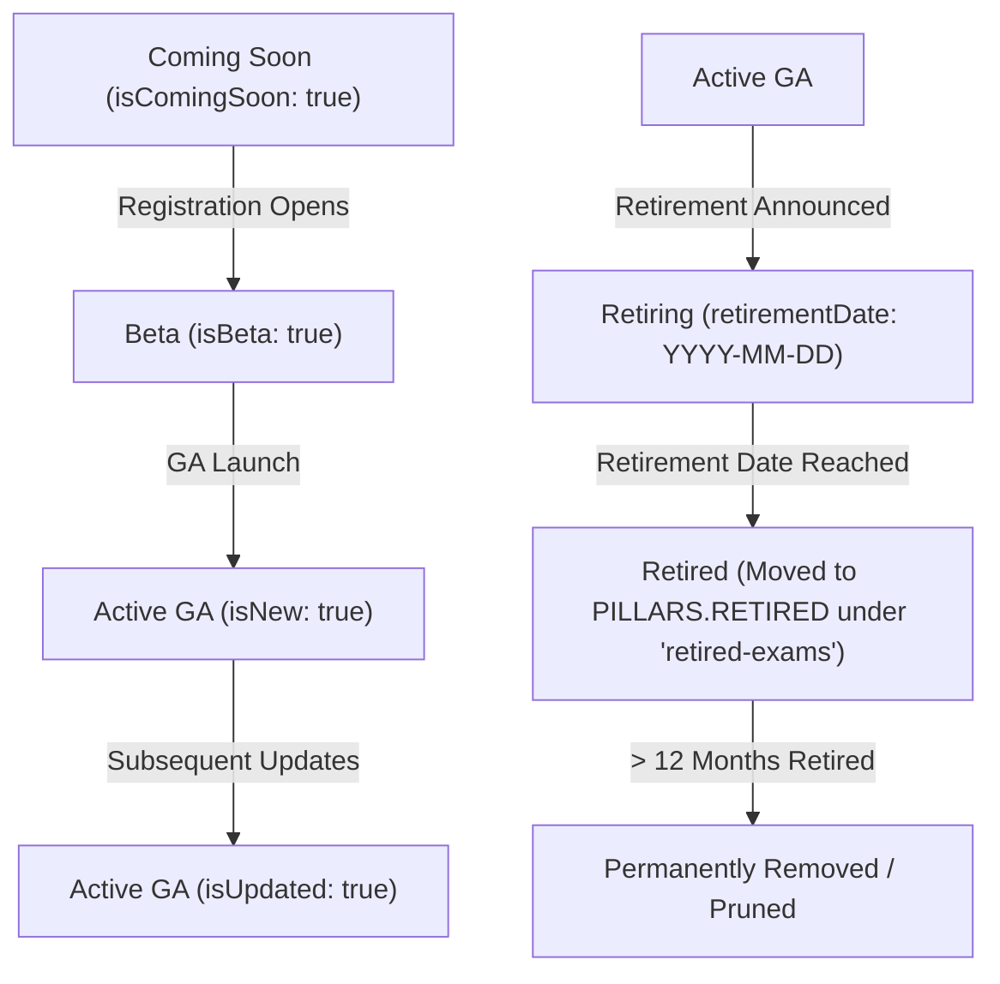
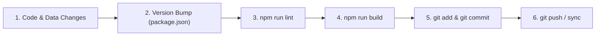

# Antigravity Agent Guidelines & Rules

This document governs the architecture, data structures, design standards, lifecycle management, state persistence, interactive engines, and development workflows for the **Microsoft Certification Tracker & Career Roadmap Tool** (`atozazure-mscertification-tool`). All automated agents and contributors must strictly adhere to these instructions.

---

## Table of Contents
1. [Core Architecture, Technology Stack & Build Pipeline](#1-core-architecture-technology-stack--build-pipeline)
   - 1.1 [Technology Ecosystem](#11-technology-ecosystem)
   - 1.2 [Domain Directory Map & Code Structure](#12-domain-directory-map--code-structure)
   - 1.3 [Vite ESM Bundler & Manual Chunking Strategy](#13-vite-esm-bundler--manual-chunking-strategy)
   - 1.4 [Single-Page Routing & Static Web App Config](#14-single-page-routing--static-web-app-config)
2. [Data Models, Catalogs & Schemas](#2-data-models-catalogs--schemas)
   - 2.1 [Pillars Enum (`PILLARS`)](#21-pillars-enum-pillars)
   - 2.2 [Active Track Catalog (11 Tracks)](#22-active-track-catalog-11-tracks)
   - 2.3 [Track & Branch Object Schemas](#23-track--branch-object-schemas)
   - 2.4 [Certification Credential Schema & Prerequisites Engine](#24-certification-credential-schema--prerequisites-engine)
   - 2.5 [Career Roles Schema (`careerRoles.js`)](#25-career-roles-schema-careerrolesjs)
   - 2.6 [Applied Skills Credential Schema (`appliedSkills.js`)](#26-applied-skills-credential-schema-appliedskillsjs)
   - 2.7 [Central Data Helper APIs](#27-central-data-helper-apis)
3. [Credential Lifecycle Management & Governance](#3-credential-lifecycle-management--governance)
   - 3.1 [Primary Sources of Truth](#31-primary-sources-of-truth)
   - 3.2 [Role-Based Certification State Machine](#32-role-based-certification-state-machine)
   - 3.3 [Rule of Recency (New & Updated Credentials)](#33-rule-of-recency-new--updated-credentials)
   - 3.4 [1-Year Expiration & Renewal Lifecycle](#34-1-year-expiration--renewal-lifecycle)
   - 3.5 [Retirement Succession & 12-Month Automated Pruning](#35-retirement-succession--12-month-automated-pruning)
   - 3.6 [Applied Skills Zero-Retired Governance](#36-applied-skills-zero-retired-governance)
   - 3.7 [Verification Quality Gates (URLs & Badges)](#37-verification-quality-gates-urls--badges)
4. [Fluent 2 Design System & Component Architecture](#4-fluent-2-design-system--component-architecture)
   - 4.1 [Strict Styling Architecture (Vanilla CSS & BEM)](#41-strict-styling-architecture-vanilla-css--bem)
   - 4.2 [Design Tokens & Dual Theme Symmetry](#42-design-tokens--dual-theme-symmetry)
   - 4.3 [Typography Ramp, Geometry & Anti-Pill Rules](#43-typography-ramp-geometry--anti-pill-rules)
   - 4.4 [Badge System & Card Placement Hierarchy](#44-badge-system--card-placement-hierarchy)
   - 4.5 [Foundation Components Standards](#45-foundation-components-standards)
   - 4.6 [Iconography System: IconMap vs ProductIcons](#46-iconography-system-iconmap-vs-producticons)
   - 4.7 [Micro-interactions, Modals & Toast Accessibility](#47-micro-interactions-modals--toast-accessibility)
5. [State Management, Persistence & Multi-Currency Engine](#5-state-management-persistence--multi-currency-engine)
   - 5.1 [LocalStorage Inventory & Key Registry (9 Keys)](#51-localstorage-inventory--key-registry-9-keys)
   - 5.2 [Backup, Restore & Reset Parity (JSON Schema)](#52-backup-restore--reset-parity-json-schema)
   - 5.3 [Multi-Currency Pricing Engine (`pricing.js`)](#53-multi-currency-pricing-engine-pricingjs)
   - 5.4 [Auto-Tracking & Prerequisite Unlock Celebrations](#54-auto-tracking--prerequisite-unlock-celebrations)
6. [Interactive Experiences & Engine Implementations](#6-interactive-experiences--engine-implementations)
   - 6.1 [React Flow + Dagre Graph Engine (`PathMap.jsx` & `CertNode.jsx`)](#61-react-flow--dagre-graph-engine-pathmapjsx--certnodejsx)
   - 6.2 [Dual Path Map Views: Metro Graph vs Linear List View (`PathMapListView.jsx`)](#62-dual-path-map-views-metro-graph-vs-linear-list-view-pathmaplistviewjsx)
   - 6.3 [Career Path Builder & Markdown Export (`CareerPathBuilder.jsx`)](#63-career-path-builder--markdown-export-careerpathbuilderjsx)
   - 6.4 [Applied Skills Hub: Poster Board & Directory Grid (`AppliedSkills.jsx`)](#64-applied-skills-hub-poster-board--directory-grid-appliedskillsjsx)
   - 6.5 [Dashboard Overview & Action Center (`Dashboard.jsx`)](#65-dashboard-overview--action-center-dashboardjsx)
   - 6.6 [Global Search, Hotkeys & Deep Linking](#66-global-search-hotkeys--deep-linking)
   - 6.7 [Routing Architecture, Shimmer Skeletons & SEO Parity](#67-routing-architecture-shimmer-skeletons--seo-parity)
7. [Developer Workflows, Quality Gates & Git Standards](#7-developer-workflows-quality-gates--git-standards)
   - 7.1 [Pre-Commit Quality Gate Sequence](#71-pre-commit-quality-gate-sequence)
   - 7.2 [Semantic Version Bumping Rules (`package.json`)](#72-semantic-version-bumping-rules-packagejson)
   - 7.3 [Conventional Commit Standards](#73-conventional-commit-standards)

---

## 1. Core Architecture, Technology Stack & Build Pipeline

### 1.1 Technology Ecosystem
- **Framework Core**: React 19 (`react 19.2+`, `react-dom 19.2+`) for high-performance concurrent UI rendering.
- **Client Routing**: React Router v7 (`react-router-dom 7.15+`).
- **Build Core**: Vite 8 (`vite 8.0+`) with `@vitejs/plugin-react 6.0+` for ESM development and optimized Rollup production builds.
- **Styling Methodology**: Vanilla CSS with strict BEM naming (`.block__element--modifier`). Strictly **no Tailwind CSS**.
- **Design Language**: Microsoft Fluent 2 Design System tokens, typography ramps, and dual light/dark themes.
- **Interactive Graph Engine**: React Flow v12 (`@xyflow/react 12.11+`) paired with Dagre (`dagre 0.8+`) layout computation.
- **Drag-and-Drop Reordering**: `@dnd-kit/core 6.3+`, `@dnd-kit/sortable 10.0+`, and `@dnd-kit/utilities 3.2+`.
- **Iconography System**: Centralized abstraction through `@fluentui/react-icons 2.0+` and custom SVG product icons via `@iconify/react 6.0+`.

### 1.2 Domain Directory Map & Code Structure
The repository is strictly partitioned by functional domain under `src/`:
- `src/data/`: Static sources of truth (`certificationPaths.js`, `careerRoles.js`, `appliedSkills.js`).
- `src/components/`: Modular feature components organized by domain:
  - `Dashboard/`: Overview stats hero, Action Center queues, tracked learning grid, and exploration catalog (`Dashboard.jsx`, `Dashboard.css`).
  - `PathMap/`: Interactive React Flow canvas, Dagre layout engine, custom certification nodes, and linear list view (`PathMap.jsx`, `CertNode.jsx`, `PathMapListView.jsx`, `CertNode.css`, `PathMap.css`).
  - `CareerPathBuilder/`: Guided career role roadmaps, drag-and-drop custom playlist timeline, and aligned applied skills integration (`CareerPathBuilder.jsx`, `CareerPathCertCard.jsx`, `SortableCertItem.jsx`, `AlignedAppliedSkills.jsx`, `CareerPathBuilder.css`, `CareerPathCertCard.css`, `AlignedAppliedSkills.css`).
  - `CertDetail/`: Slide-over drawer and comprehensive certification details modal (`CertDetail.jsx`, `CertDetail.css`).
  - `AppliedSkills/`: Interactive poster board view, searchable lab directory grid, and detail drawer (`AppliedSkills.jsx`, `AppliedSkillCard.jsx`, `AppliedSkillDetail.jsx`, `AppliedSkills.css`).
  - `Layout/`: Top brand header, collapsible navigation sidebar, and theme switcher (`Header.jsx`, `Sidebar.jsx`, `ThemeToggle.jsx`, `Header.css`, `Sidebar.css`, `ThemeToggle.css`).
  - `common/`: Foundation components (`Badge.jsx`, `DataModal.jsx`, `IconMap.jsx`, `ProductIcons.jsx`, `ProgressRing.jsx`, `SearchBar.jsx`, `SEO.jsx`, `Toast.jsx`, `index.js`).
- `src/context/`: React Context providers (`ProgressContext.jsx`, `ThemeContext.jsx`, `CurrencyContext.jsx`, `ToastContext.jsx`).
- `src/hooks/`: State orchestration and persistence hooks (`useProgress.js`).
- `src/utils/`: Helpers, SVG badge resolvers, date formatters, and pricing engines (`helpers.js`, `pricing.js`).
- `src/assets/`: Static SVGs for Microsoft products, pillars, and badges (`assets/icons/`).

### 1.3 Vite ESM Bundler & Manual Chunking Strategy
To guarantee fast page loads and optimal client-side caching, `vite.config.js` enforces deterministic Rollup chunk splitting across third-party dependencies:
```javascript
// vite.config.js
export default defineConfig({
  plugins: [react()],
  build: {
    rollupOptions: {
      output: {
        manualChunks(id) {
          if (!id.includes('node_modules')) return;

          // React Core runtime
          if (
            id.includes('/node_modules/react/') ||
            id.includes('/node_modules/react-dom/') ||
            id.includes('/node_modules/react-router/') ||
            id.includes('/node_modules/react-router-dom/') ||
            id.includes('\\node_modules\\react\\') ||
            id.includes('\\node_modules\\react-dom\\') ||
            id.includes('\\node_modules\\react-router\\') ||
            id.includes('\\node_modules\\react-router-dom\\')
          ) {
            return 'vendor-core';
          }

          // React Flow and graph layout engine (used on /path/:pathId)
          if (id.includes('@xyflow') || id.includes('dagre')) {
            return 'vendor-flow';
          }

          // Drag and drop sorting kit (used on /career-paths)
          if (id.includes('@dnd-kit')) {
            return 'vendor-dnd';
          }

          // Fluent UI and product icons
          if (id.includes('@fluentui') || id.includes('@iconify')) {
            return 'vendor-icons';
          }
        },
      },
    },
  },
});
```

### 1.4 Single-Page Routing & Static Web App Config
Client-side HTML5 deep routing across all subpaths (`/path/:pathId`, `/career-paths`, `/applied-skills`) is governed by Azure Static Web Apps rewrite configuration in `staticwebapp.config.json`:
```json
{
  "navigationFallback": {
    "rewrite": "/index.html"
  },
  "trailingSlash": "never"
}
```

---

## 2. Data Models, Catalogs & Schemas

### 2.1 Pillars Enum (`PILLARS`)
All certification paths and applied skills belong to one of four core pillars defined in `src/data/certificationPaths.js`:
```javascript
export const PILLARS = {
  CLOUD_AI: 'Cloud & AI Platforms',
  BIZ_SOLUTIONS: 'AI Business Solutions',
  SECURITY: 'Security',
  RETIRED: 'Retired & Archived',
};
```

### 2.2 Active Track Catalog (11 Tracks)
The catalog manages **11 distinct technology tracks** across the 4 pillars:
| Track ID | Track Name | Short Name | Code | Pillar | Color Variable | Glow Variable |
|---|---|---|---|---|---|---|
| `azure-infrastructure` | Azure Apps & Infrastructure | Azure Infrastructure | `AZ` | `PILLARS.CLOUD_AI` | `var(--line-azure)` | `var(--glow-azure)` |
| `ai-machine-learning` | Artificial Intelligence | Azure AI | `AI` | `PILLARS.CLOUD_AI` | `var(--line-ai)` | `var(--glow-ai)` |
| `data-engineering` | Data Platform | Data & Analytics | `DP` | `PILLARS.CLOUD_AI` | `var(--line-data)` | `var(--glow-data)` |
| `security` | Security, Compliance, and Identity | Security & Identity | `SC` | `PILLARS.SECURITY` | `var(--line-security)` | `var(--glow-security)` |
| `microsoft-365` | Modern Workplace | Microsoft 365 | `MS` | `PILLARS.BIZ_SOLUTIONS` | `var(--line-m365)` | `var(--glow-m365)` |
| `power-platform` | Business Applications | Power Platform | `PL` | `PILLARS.BIZ_SOLUTIONS` | `var(--line-power)` | `var(--glow-power)` |
| `agentic-ai` | AI Business Solutions | Agentic AI | `AB` | `PILLARS.BIZ_SOLUTIONS` | `var(--line-agentic)` | `var(--glow-agentic)` |
| `dynamics-365` | Microsoft Dynamics 365 | Dynamics 365 | `MB` | `PILLARS.BIZ_SOLUTIONS` | `var(--line-dynamics)` | `var(--glow-dynamics)` |
| `azure-devops` | Azure DevOps | DevOps | `AZ` | `PILLARS.CLOUD_AI` | `var(--line-devops)` | `var(--glow-devops)` |
| `github` | GitHub | GitHub | `GH` | `PILLARS.CLOUD_AI` | `var(--line-github)` | `var(--glow-github)` |
| `retired-exams` | Retired Certifications | Archived Exams | `ARCHIVE` | `PILLARS.RETIRED` | `var(--line-retired)` | `var(--glow-retired)` |

### 2.3 Track & Branch Object Schemas
Each track object in `src/data/certificationPaths.js` adheres to this schema:
| Field | Type | Description |
|---|---|---|
| `id` | `string` (kebab-case) | Unique track identifier (e.g. `'azure-infrastructure'`, `'retired-exams'`). |
| `name` | `string` | Full path track title. |
| `shortName` | `string` | Compact title used in navigation cards, sidebar links, and badges. |
| `code` | `string` | Uppercase prefix code (e.g. `'AZ'`, `'SC'`, `'AI'`, `'ARCHIVE'`). |
| `pillar` | `PILLARS.*` | Pillar category mapping. |
| `color` | `string` | CSS variable for path line (e.g. `'var(--line-azure)'`). |
| `glowColor` | `string` | CSS variable for path glow highlight. |
| `cssVar` | `string` | Raw CSS variable name without `var()` (e.g. `'--line-azure'`). |
| `icon` | `string` | Key mapped in `src/components/common/IconMap.jsx`. |
| `description` | `string` | Concise overview of the track scope. |
| `branches` | `Array<Branch>` | Branch definitions: `[{ id: 'admin', name: 'Admin', description: '...' }]`. |
| `certifications`| `Array<Cert>` | Array of certification objects belonging to this path track. |

### 2.4 Certification Credential Schema & Prerequisites Engine
#### Levels (`CERT_LEVELS`):
```javascript
export const CERT_LEVELS = {
  FUNDAMENTALS: 'Fundamentals',
  ASSOCIATE: 'Associate',
  EXPERT: 'Expert',
  SPECIALTY: 'Specialty',
};
```

#### Statuses (`CERT_STATUS`):
```javascript
export const CERT_STATUS = {
  NOT_STARTED: 'not_started',
  IN_PROGRESS: 'in_progress',
  COMPLETED: 'completed',
  NEEDS_RENEWAL: 'needs_renewal',
};
```

#### Certification Object Schema:
- **Mandatory Fields**:
  - `id`: Lowercase kebab-case string matching the exam ID (e.g. `'az-104'`, `'ai-102'`).
  - `examCode`: Uppercase official exam code string (e.g. `'AZ-104'`, `'AI-102'`).
  - `name`: Full certification credential title (e.g. `'Azure Administrator Associate'`).
  - `level`: One of `CERT_LEVELS` (`'Fundamentals'`, `'Associate'`, `'Expert'`, `'Specialty'`).
  - `description`: Comprehensive summary of the certification scope and target persona.
  - `prerequisites`: Evaluation requirements:
    - **Single/All Required**: Array of cert IDs e.g. `['az-104']` (all must be completed).
    - **Choice Groups ("1 of N")**: Nested arrays e.g. `[['az-104', 'az-204']]` or `[['sc-200', 'sc-300', 'sc-500']]` (satisfying any one unlocks the prerequisite).
    - **None**: Empty array `[]`.
  - `learnUrl`: Verified, active Microsoft Learn exam page URL.
  - `retirementDate`: `'YYYY-MM-DD'` string if announced, otherwise `null`.
  - `skillsMeasured`: Array of strings detailing objective domains and percentage weightings.
- **Optional Fields**:
  - `recommendedPrereqs`: Array of cert IDs (e.g. `['az-900']`) recommended for foundational learning but not strictly required.
  - `branch`: Lowercase string matching one of the parent path's `branches[].id` values.
  - `isBeta`: `true` or `'Beta from <Month> <Year>'` (e.g. `'Beta from July 2026'`).
  - `isNew`: `true` (renders `<Badge variant="new">New</Badge>`). Governed by Rule of Recency.
  - `isUpdated`: `true` (renders `<Badge variant="updated">Updated</Badge>`). Governed by Rule of Recency.
  - `isComingSoon`: `true` (renders `<Badge variant="default">Coming soon</Badge>`).
  - `isIndependent`: `true` (marks standalone, disconnected, or retired certs in layout engines).
  - `isShared`: `true` (set when a certification is shared across multiple tracks, e.g. `az-900` in `azure-devops`).
  - `sharedWith`: Track ID of the primary owning path (e.g. `'azure-infrastructure'`).
- **Runtime Computed Properties**:
  - `role`: Primary matched role title string.
  - `roles`: Array of matched role titles.
  - `roleData`: Array of matched role objects from `careerRoles.js` (with title, color, and icon).

> [!IMPORTANT]
> **No Hardcoded Roles on Certs**: Do **NOT** hardcode `role`, `roles`, or `roleData` on certification objects in `certificationPaths.js`. These are computed dynamically at runtime on module initialization by matching against `src/data/careerRoles.js`.

### 2.5 Career Roles Schema (`src/data/careerRoles.js`)
Each role profile defines a career pathway:
- `id`: Lowercase kebab-case string (e.g. `'ai-engineer'`, `'solutions-architect'`).
- `title`: Display name of the career role.
- `description`: Role responsibilities summary.
- `icon`: Key mapped in `IconMap.jsx`.
- `color`: CSS variable for role theme accent.
- `certs`: Array of valid certification IDs mapped to this career role.

> [!WARNING]
> **Cross-Reference Integrity**: Whenever a certification ID is added, renamed, or retired in `certificationPaths.js`, you **must** audit `src/data/careerRoles.js` to ensure the `certs: [...]` arrays contain no dangling or broken IDs.

### 2.6 Applied Skills Credential Schema (`src/data/appliedSkills.js`)
Applied skills represent scenario-based, interactive lab assessments:

#### Enums:
```javascript
export const APPLIED_SKILL_LEVELS = {
  BEGINNER: 'Beginner',
  INTERMEDIATE: 'Intermediate',
};

export const APPLIED_SKILL_FOCUS = {
  TECHNICAL: 'Technical',
  BUSINESS: 'Business',
};

export const APPLIED_SKILL_STATUS = {
  NOT_STARTED: 'not_started',
  IN_PROGRESS: 'in_progress',
  COMPLETED: 'completed',
};
```

#### Applied Skill Object Schema:
| Field | Type | Description |
|---|---|---|
| `id` | `string` (kebab-case) | Unique slug identifier (e.g. `'accelerate-app-development-by-using-github-copilot'`). |
| `uid` | `string` | Unique namespace ID prefixed with `applied-skill.` (e.g. `'applied-skill.accelerate-app-development-by-using-github-copilot'`). |
| `title` | `string` | Official credential title as listed on Microsoft Learn. |
| `pillar` | `PILLARS.*` | Pillar category mapping (`CLOUD_AI`, `BIZ_SOLUTIONS`, `SECURITY`). |
| `level` | `APPLIED_SKILL_LEVELS.*` | Difficulty tier (`'Beginner'`, `'Intermediate'`). |
| `focus` | `APPLIED_SKILL_FOCUS.*` | Focus area (`'Technical'`, `'Business'`). |
| `isNew` | `boolean` | `true` renders `<Badge variant="new">New</Badge>`. Governed by Rule of Recency. |
| `duration` | `string` | Estimated completion time (e.g. `'~2 hours'`). |
| `cost` | `string` | Cost indicator (e.g. `'Free'`). |
| `learnUrl` | `string` | Verified, active Microsoft Learn assessment lab page URL. |
| `summary` | `string` | Comprehensive summary of the lab assessment scenario and target persona. |
| `roles` | `Array<string>` | Target job roles (e.g. `['developer', 'ai-engineer']`). |
| `products` | `Array<string>` | Associated Microsoft product slugs (e.g. `['github', 'vs-code']`). |
| `subjects` | `Array<string>` | Subject domain tags (e.g. `['artificial-intelligence', 'app-development']`). |
| `relatedCerts` | `Array<string>` | Exam IDs reinforced by this lab (e.g. `['ai-102', 'ai-500']`). Must reference active exam IDs. |

### 2.7 Central Data Helper APIs
Always leverage existing central helper functions:
- **`src/data/certificationPaths.js`**:
  - `getCertById(id)`: Returns `{ cert, path }` or `null`.
  - `getAllCertifications()`: Returns flattened array of all certifications with path metadata (`pathId`, `pathName`, `pathColor`).
  - `getPathById(pathId)`: Returns the track object or `undefined`.
  - `getCertificationsRequiring(certId)`: Returns array of certifications listing `certId` as a prerequisite.
  - `doesCertExpire(level)`: Returns boolean indicating if the level requires annual renewal (`Associate`, `Expert`, `Specialty`).
- **`src/data/appliedSkills.js`**:
  - `getAllAppliedSkills()`: Returns all active Applied Skills credentials (35 active credentials).
  - `getAppliedSkillById(id)`: Returns the Applied Skill object or `null`.
  - `getAppliedSkillsByPillar(pillar)`: Returns Applied Skills filtered by pillar.
  - `getAppliedSkillsForCert(certId)`: Returns all Applied Skills that reinforce a specific certification ID.
- **`src/utils/helpers.js`**:
  - `isRetiring(cert)`: Returns `true` if `retirementDate` is in the future.
  - `isRetired(cert)`: Returns `true` if `retirementDate` is in the past.
  - `formatDate(dateStr)`: Localized human-readable date formatter (e.g. `'January 1, 2025'`).
  - `getBadgeUrl(level, certId)`: Resolves official Microsoft Learn SVG credential badge (including overrides for `ab-700`, `ab-701`, `ab-730`, `ab-731`).
  - `getAppliedSkillBadgeUrl()`: Returns official Applied Skills badge SVG URL.
- **`src/utils/pricing.js`**:
  - `getCostsForLevel(level)`: Returns `{ GBP, USD, EUR }` tier cost mapping.
  - `getExamCost(level, currency)`: Returns numeric cost amount for level and currency.
  - `getFormattedExamCost(level, currency)`: Returns formatted currency string (e.g. `"£132"`).

---

## 3. Credential Lifecycle Management & Governance

### 3.1 Primary Sources of Truth
1. **Microsoft Tech Community Skills Hub**:
   **https://techcommunity.microsoft.com/category/skills-hub/blog/skills-hub-blog**
2. **Official Credential Retirement Registry**:
   **https://learn.microsoft.com/en-us/credentials/support/credential-retirement**
3. **Microsoft Learn Live Examination & Assessment Directory**:
   **https://learn.microsoft.com/en-us/credentials/**

### 3.2 Role-Based Certification State Machine


1. **Coming Soon**: Announced credentials prior to registration or beta availability carry `isComingSoon: true`.
2. **Transition to Beta**: When registration opens, remove `isComingSoon` and set `isBeta: true` or `isBeta: 'Beta from Month YYYY'`.
3. **Transition from Beta to GA**: When the exam reaches General Availability, remove `isBeta` and add `isNew: true`.
4. **Retiring State**: When retirement is announced, set `retirementDate: 'YYYY-MM-DD'` and display the `"Retiring"` badge while keeping the credential in its active path.

### 3.3 Rule of Recency (New & Updated Credentials)
- **New Credentials**: Newly added exams receive `isNew: true`.
- **Updated Credentials**: Modified exams receive `isUpdated: true`.
- **Enforcing Recency**: Whenever additions or updates are made, actively scan `src/data/certificationPaths.js` and `src/data/appliedSkills.js` to remove stale `isNew: true` and `isUpdated: true` flags from older entries. Only the most recent cohort of updates should carry badges.

### 3.4 1-Year Expiration & Renewal Lifecycle
- Exams at `Associate`, `Expert`, and `Specialty` levels require annual renewal (`doesCertExpire(level) === true`). `Fundamentals` exams do not expire.
- If a completed certification's completion timestamp recorded in `completionDates[certId]` is older than 365 days, `getStatus(certId)` automatically returns `CERT_STATUS.NEEDS_RENEWAL`.
- Completing or renewing a certification resets the status to `CERT_STATUS.COMPLETED` and updates the completion timestamp in `completionDates`.

### 3.5 Retirement Succession & 12-Month Automated Pruning
- **Retirement Transition**: When an exam passes its retirement date, move it to `PILLARS.RETIRED` under track `id: 'retired-exams'`. Set `branch: 'retired'` and `isIndependent: true`.
- **Prerequisite Succession**: Audit all active exams that listed the retired exam as a prerequisite and update them to point to the official successor credential (e.g. updating `dp-203` to `dp-700`).
- **12-Month Automated Pruning**: When a certification has been retired for **more than 12 months** (i.e. `retirementDate` is more than 1 year in the past), permanently delete the certification entry from `src/data/certificationPaths.js` and clean up any residual references in `src/data/careerRoles.js`.

### 3.6 Applied Skills Zero-Retired Governance
Because Microsoft Applied Skills interactive assessment labs become completely unavailable once retired, Applied Skills follow a strict zero-tolerance policy:
- **Zero Retired Skills**: Retired Applied Skills must **never** be added to `src/data/appliedSkills.js`.
- **Immediate Pruning**: When an Applied Skill is announced as retired or decommissioned on Microsoft Learn, it must be **immediately removed and pruned** from `src/data/appliedSkills.js`. They are never archived under `PILLARS.RETIRED`.
- **Recency & URLs**: New skills carry `isNew: true` governed by the Rule of Recency. All URLs must return HTTP 200 with no retirement banner warnings.

### 3.7 Verification Quality Gates (URLs & Badges)
- **Link Verification**: Every Microsoft Learn link must resolve to an active, HTTP 200 page without 404s or retirement notices.
- **Badge URL Resolution**:
  - `getBadgeUrl(level, certId)` maps credentials to official SVGs.
  - Special badge filenames (e.g. `ab-730`, `ab-731`, `ab-700`, `ab-701`) must have explicit mappings.
  - Applied Skills resolve via `getAppliedSkillBadgeUrl()`.
  - Always use `loading="lazy"` on badge `` elements with fallback to `IconMap.Award`.

---

## 4. Fluent 2 Design System & Component Architecture

### 4.1 Strict Styling Architecture (Vanilla CSS & BEM)
- **NO Tailwind CSS**: Do not use Tailwind utility classes (`flex`, `bg-white`, `p-4`, etc.). Use Vanilla CSS structured via BEM (`.block__element--modifier`).
- **NO Hardcoded Colors**: Raw hex or rgb values in component CSS files are strictly forbidden. Always use CSS variables defined in `src/index.css`.
- **Inline Variables**: Passing dynamic CSS variables via inline styles (e.g. `style={{ '--card-color': path.color }}`) is encouraged for data-driven theming.

### 4.2 Design Tokens & Dual Theme Symmetry
Every CSS variable in `src/index.css` must have dual definitions in `:root` (light) and `[data-theme="dark"]` (dark):
- **Surfaces**: `--colorNeutralBackground1` (cards), `--colorNeutralBackground2` (app background), `--bg-surface-1`, `--bg-surface-hover`.
- **Typography/Foreground**: `--colorNeutralForeground1` (primary), `--colorNeutralForeground2` (secondary), `--colorNeutralForeground3` (tertiary).
- **Borders**: `--colorNeutralStroke1` (strong), `--colorNeutralStroke2` (default), `--colorNeutralStroke3` (subtle).
- **Theme Accents & Glows**: `--line-<track>` (e.g. `--line-azure`, `--line-ai`, `--line-security`, `--line-retired`) and `--glow-<track>`.
- **Elevation**: `--shadow-2` (soft), `--shadow-4` (medium), `--shadow-8` (flyout/modal), `--shadow-16`, `--shadow-28`.
- **Layout Metrics**: `--header-height: 48px`, `--sidebar-width: 280px`, `--sidebar-collapsed: 64px`, `--content-max-width: 1400px`.
- **Standard Z-Index Scale**: `--z-base: 0`, `--z-dropdown: 100`, `--z-sidebar: 200`, `--z-header: 300`, `--z-overlay: 400`, `--z-modal: 500`, `--z-toast: 600`. Never use arbitrary values like `9999`.

### 4.3 Typography Ramp, Geometry & Anti-Pill Rules
- **Typography**: Brand typeface `'Segoe UI Variable'`, `'Segoe UI'`, sans-serif. Monospace: `'Cascadia Code'`, monospace.
- **Spacing**: Fluent 2 Base-4 scale: `--space-1` (4px), `--space-2` (8px), `--space-3` (12px), `--space-4` (16px), `--space-6` (24px), `--space-8` (32px).
- **Element Heights**: Standard interactive elements (buttons, inputs, dropdowns) are `32px`. Compact buttons are `26px`.
- **Corner Radii**: Cards use `--radius-lg` (8px), inputs/buttons use `--radius-md` (4px), small tags use `--radius-sm` (2px).
- **Anti-Pill Rule**: Badges, status tags, and segmented controls must use standard rounded corners (`--radius-md` or `--radius-sm`). **Avoid fully rounded pill shapes** (`--radius-full`) except for small circular status dots.

### 4.4 Badge System & Card Placement Hierarchy
#### Supported Badge Variants (`src/components/common/Badge.jsx`):
| Variant | Color Token | Usage |
|---|---|---|
| `variant="default"` | `--badge-default-*` | Neutral secondary info, prerequisites, optional tags. |
| `variant="fundamentals"` | `--badge-fundamentals-*` | Fundamentals level credentials. |
| `variant="associate"` | `--badge-associate-*` | Associate level credentials. |
| `variant="expert"` | `--badge-expert-*` | Expert level credentials. |
| `variant="retiring"` | `--badge-retiring-*` | Retiring / Retired exam warnings. |
| `variant="completed"` | `--badge-completed-*` | Completed certs. |
| `variant="in-progress"` | `--badge-inprogress-*` | Currently studying certs. |
| `variant="new"` | `--badge-new-*` | Newly added certifications & skills. |
| `variant="updated"` | `--badge-updated-*` | Recently updated certifications. |
| `variant="beta"` | `--badge-beta-*` | Beta exams. |
| `variant="technical"` | `--badge-technical-*` | Applied Skills technical focus. |
| `variant="business"` | `--badge-business-*` | Applied Skills business focus. |

#### Card Placement Hierarchy:
- **Card Header**: Only place state-based informational badges (`Beta`, `Retiring`, `Retired`, `Optional`, `New`, `Updated`, `Coming soon`).
- **Card Footer**: Only place structural badges (`Level` e.g. "Associate", and prerequisite requirements e.g. "Prereq: AZ-104", "1 of 3").

### 4.5 Foundation Components Standards
Shared components reside in `src/components/common/` with centralized barrel export in `index.js`:
- **`SEO.jsx`**: Dynamically synchronizes document `<title>`, description, canonical links, Open Graph tags, Twitter cards, and JSON-LD schema (`#route-structured-data`). **Every primary route must include `<SEO />`**.
- **`SearchBar.jsx`**: Universal search component with debounced query (250ms), keyboard hotkey (`Ctrl+K`/`Cmd+K`), autocomplete dropdown, outside click/touch dismissal, and mobile expand mode.
- **`ProgressRing.jsx`**: Custom SVG circular progress indicator with customizable `percent`, `size`, `strokeWidth`, `color`, and `showPercent`.
- **`DataModal.jsx`**: Progress management modal providing JSON backup export, backup file upload/import validation, global currency switching, and reset with two-step confirmation.
- **`ThemeToggle.jsx`**: Accessible 3-way theme toggle (`light`, `dark`, `system`) synchronizing with `data-theme` attribute on `<html>`, system color scheme media queries, and storage key `ms-cert-tracker-theme`.
- **`Toast.jsx` & `ToastContext.jsx`**: Global toast notification system (`success`, `error`, `info`, `warning`) with interactive action buttons and automatic dismissal.

### 4.6 Iconography System: IconMap vs ProductIcons
- **Central Icon Abstraction (`IconMap.jsx`)**: Do not import `@fluentui/react-icons` directly into feature components. Import the `...Regular` variant into `IconMap.jsx`, wrap with `withSize(...)`, and export as a named key.
- **Product Icons (`ProductIcons.jsx`)**: Full-color product/service SVGs (Azure, Copilot, GitHub, Power Platform, Fabric, Dynamics) are maintained in `ProductIcons.jsx`. Their container background must be set to `transparent`.

### 4.7 Micro-interactions, Modals & Toast Accessibility
- **Push Effect**: Apply active micro-animations to interactive buttons and cards: `:active { transform: scale(0.96); }` paired with standard Fluent transitions.
- **Modal Accessibility**: All modals/drawers (`DataModal.jsx`, `CertDetail.jsx`, `AppliedSkillDetail.jsx`) must support `Escape` key dismissal, backdrop click dismissal, and background scroll locking (`document.body.style.overflow = 'hidden'`).
- **Toast Notifications**: Always invoke `addToast(message, type)` when users perform actions (exporting/importing data, resetting progress, toggling tracks, cycling status, copying links).

---

## 5. State Management, Persistence & Multi-Currency Engine

### 5.1 LocalStorage Inventory & Key Registry (9 Keys)
State is persisted to `localStorage` with safe `try/catch` fallbacks across `useProgress.js`, `ThemeContext.jsx`, and `CurrencyContext.jsx`:
1. `ms-cert-tracker-progress`: Object mapping `{ [certId]: CERT_STATUS }`.
2. `ms-cert-tracker-tracked-paths`: Array of active path IDs. (Migrates automatically from legacy `ms-cert-tracker-ignored`).
3. `ms-cert-tracker-tracked-certs`: Array of active cert IDs.
4. `ms-cert-tracker-dismissed-certs`: Array of dismissed cert IDs.
5. `ms-cert-tracker-dates`: Object mapping `{ [certId]: ISOString }` completion timestamps.
6. `ms-cert-tracker-custom-playlist`: Array of ordered cert IDs representing the custom career timeline.
7. `ms-cert-tracker-applied-skills`: Object mapping `{ [skillId]: APPLIED_SKILL_STATUS }`.
8. `ms-cert-tracker-theme`: Selected theme preference (`'light'`, `'dark'`, `'system'`).
9. `atozazure_currency`: Selected currency code (`'GBP'`, `'USD'`, `'EUR'`).

### 5.2 Backup, Restore & Reset Parity (JSON Schema)
Any new persistent property added to state **must** be wired into:
1. `exportProgressJSON()` — included in the backup JSON schema:
   ```json
   {
     "app": "ms-skills-navigator",
     "version": "1.11.0",
     "exportedAt": "ISOString",
     "progress": {},
     "trackedPaths": [],
     "trackedCerts": [],
     "dismissedCerts": [],
     "completionDates": {},
     "customPlaylist": [],
     "appliedSkills": {}
   }
   ```
2. `importProgressJSON()` — validated, safely parsed, and merged.
3. `resetAll()` — completely cleared from state and `localStorage`.

### 5.3 Multi-Currency Pricing Engine (`pricing.js`)
- Supported currencies: `GBP` (£, default), `USD` ($), `EUR` (€).
- Pricing Tiers:
  - `Fundamentals`: £69 / $99 / €99.
  - `Associate` / `Expert` / `Specialty`: £132 / $165 / €165.
- Helper functions: `getCostsForLevel(level)`, `getExamCost(level, currency)` for calculations and `getFormattedExamCost(level, currency)` (e.g. `"£132"`) for UI presentation. Never hardcode currency symbols.

### 5.4 Auto-Tracking & Prerequisite Unlock Celebrations
- **Auto-Tracking**: Marking a certification as `in_progress` or `completed` automatically appends its ID to `trackedCerts`.
- **Prerequisite Unlock Celebrations**: Marking an exam as `COMPLETED` evaluates `getCertificationsRequiring(cert.id)`. If dependent certifications are unstarted, a celebration toast triggers with an interactive action button to mark the unlocked credential as `in_progress`.

---

## 6. Interactive Experiences & Engine Implementations

### 6.1 React Flow + Dagre Graph Engine (`PathMap.jsx` & `CertNode.jsx`)
- **Standard Active Tracks (Dagre Engine)**:
  - Coordinates generated via Dagre (`rankdir: 'TB'`, `nodesep: 40`, `ranksep: 80`).
  - Edges rendered as `smoothstep` paths between connected stations.
  - Target handle on Top and Source handle on Bottom with `opacity: 0`.
- **Retired Certifications Track (`retired-exams`)**:
  - Because retired exams are independent with no sequential graph hierarchy, the path utilizes a **3-column responsive grid layout** (`cols: 3`, `colWidth: 440`, `rowHeight: 270`) without dependency edges.
- **Node Dimensions & Caching**:
  - Node dimensions are fixed at `400px` width x `230px` height. Custom nodes (`CertNode.jsx`) must fit within these dimensions without overflow or clipping.
  - Layout positions and edges are cached per path in `layoutPositionsCache = new Map()` to eliminate redundant Dagre re-computations.
  - Viewport preservation: Uses the `lastFittedPath` pattern to prevent unwanted canvas re-centering when updating node statuses within the active path.

### 6.2 Dual Path Map Views: Metro Graph vs Linear List View (`PathMapListView.jsx`)
- **Metro Graph View (`PathMapFlow`)**: Visual interactive canvas for exploring prerequisites and certification branch hierarchies.
- **List View (`PathMapListView`)**: Linear, accessible directory view grouped into:
  1. *Foundational Credentials* (trunk fundamentals).
  2. *Pathway Branches* (grouped by defined branches).
  3. *Advanced Credentials* (trunk associate/expert/specialty).
- Features inline status selectors (`Not Started`, `In Progress`, `Passed`) and filter pill controls for branch and status.

### 6.3 Career Path Builder & Aligned Applied Skills Integration (`CareerPathBuilder.jsx`)
- **Interactive Role Pathways**: Guided career roadmaps aligned with official Microsoft job roles, featuring dual progress metrics (Certifications passed and Aligned Applied Skills earned) in the role pathway overview banner.
- **Sequential Learning Flow (Step 1 Prep Labs $\rightarrow$ Step 2 Target Exam)**:
  - Inside `CareerPathCertCard.jsx`, milestone stages with aligned Applied Skills present a clear sequential learning journey:
    1. **Step 1 • Hands-on Lab Preparation**: Practical scenario-based lab credentials positioned first to build practical skills before taking the exam.
    2. **Directional Flow Connector**: Visual directional connector (`↓ Hands-on prep leads to target certification`) linking Step 1 into Step 2.
    3. **Step 2 • Target Certification Exam**: Proctored certification exam capstone containing exam badge, title, code, level, prerequisites, Learn link, Add to Custom, and Passed status toggle.
  - Certifications without aligned skills cleanly omit Step 1 and render the standalone exam card directly.
- **Aligned Applied Skills Component (`AlignedAppliedSkills.jsx`)**:
  - Queries `getAppliedSkillsForCert(cert.id)` to display hands-on scenario labs validating that specific exam.
  - Interactive 3-state progress control (`Not Started`, `In Progress`, `Earned`) directly updating `appliedSkillsProgress` with real-time progress bar and milestone toasts (`🎉 All N Applied Skills for EXAM earned!`).
  - Quick actions to launch sandbox labs on Microsoft Learn or open the full scenario modal drawer (`AppliedSkillDetail.jsx`).
- **Custom Career Playlist (`SortableCertItem.jsx`)**:
  - Drag-and-drop reordering utilizing `@dnd-kit/core` and `@dnd-kit/sortable` with `verticalListSortingStrategy`.
  - Binds both `PointerSensor` (with `activationConstraint: { distance: 8 }` to prevent dragging on click) and `KeyboardSensor` (`sortableKeyboardCoordinates`).
  - Custom timeline cards also position aligned Applied Skills as preparatory milestones before the exam description.
- **Timeline Export & Dynamic SEO**:
  - Supports Markdown timeline export (`custom-career.md` with `# My Custom Career`).
  - Dynamically updates `<SEO />` title and description based on the active role selection.

### 6.4 Applied Skills Hub: Poster Board & Directory Grid (`AppliedSkills.jsx`)
- **Poster Board View**: 3-column layout matching Microsoft's official Applied Skills poster (`Cloud & AI Platforms`, `AI Business Solutions`, `Security`).
- **Directory Grid View**: Searchable catalog with multi-facet filtering (Pillar, Level, Focus, Progress Status, and Search query).
- **Detail Drawer (`AppliedSkillDetail.jsx`)**: Accessible slide-over drawer with scenario summary, related role-based exams (with deep links to `/path/:pathId?cert=:certId`), status switcher, and direct Microsoft Learn assessment lab launcher.

### 6.5 Dashboard Overview & Action Center (`Dashboard.jsx`)
- **Hero Overview Panel**: Global stats (Completed, In Progress, Needs Renewal, Applied Skills count, Total Paths) with SVG Progress Ring.
- **Action Center**: Focused queues for In Progress exams and certs requiring annual renewal.
- **Tracked Learning vs Explore Catalog**: Separate panels for tracked paths, individually tracked certifications from untracked paths, and catalog exploration for untracked paths.

### 6.6 Global Search, Hotkeys & Deep Linking
- **Global Hotkeys**:
  - `Ctrl+K` / `Cmd+K`: Focus search bar.
  - `Ctrl+B` / `Cmd+B`: Toggle sidebar navigation.
- **Deep Linking Query Params**: `?cert=<certId>` on `/path/:pathId` and `?role=<roleId>` on `/career-paths`.
- **Keyboard Shortcut Guard**: Always check `if (['INPUT', 'TEXTAREA', 'SELECT'].includes(e.target.tagName) || e.target.isContentEditable) return;` before processing single-key shortcuts.
- **In `CertDetail`**:
  - `Escape`: Close drawer/modal.
  - `S`: Cycle status (`not_started` $\rightarrow$ `in_progress` $\rightarrow$ `completed`).
  - `E`: Toggle tracking / exclusion.
  - `Enter`: Open Microsoft Learn link.

### 6.7 Routing Architecture, Shimmer Skeletons & SEO Parity
- **Routes**:
  - `/`: Dashboard (`Dashboard.jsx`)
  - `/career-paths`: Career Path Builder (`CareerPathBuilder.jsx`)
  - `/path/:pathId`: Interactive Path Map (`PathMap.jsx`)
  - `/applied-skills`: Applied Skills Hub (`AppliedSkills.jsx`)
  - `*`: Redirect to `/`
- **Code Splitting**: Lazy-loaded routes must render Fluent shimmer loading skeletons (`.loading-skeleton`).
- **SEO Parity**: All 4 primary routes must invoke `<SEO title="..." description="..." canonical="..." />` to keep head metadata synchronized.

---

## 7. Developer Workflows, Quality Gates & Git Standards

Whenever you are asked to commit and synchronize changes, you **must** follow this strict quality gate sequence:



### 7.1 Pre-Commit Quality Gate Sequence
1. **Apply & Verify Changes**: Ensure all data schemas, component logic, styles, and unit features are complete and error-free.
2. **Version Bump**: Increment `package.json` according to semantic impact.
3. **Lint**: Run `npm run lint` and resolve any ESLint errors or warnings.
4. **Build**: Run `npm run build` to verify Vite compiles and bundles with zero errors.
5. **Stage & Commit**: Write commits adhering to Conventional Commits.
6. **Push / Sync**: Synchronize commits to remote repository.

### 7.2 Semantic Version Bumping Rules (`package.json`)
Increment the version in `package.json` according to semantic change impact:
- **Patch** (e.g. `1.13.10` $\rightarrow$ `1.13.11`): Bug fixes, minor tweaks, routine data/lifecycle updates, exam retirement dates, metadata additions.
- **Minor** (e.g. `1.13.0` $\rightarrow$ `1.14.0`): Substantial UI additions, builder features, new tracks, export tools, currency additions.
- **Major** (e.g. `1.0.0` $\rightarrow$ `2.0.0`): Architectural overhauls or major breaking changes.

> [!NOTE]
> **Documentation Exception**: Do **not** bump `package.json` if only updating non-application documentation files (e.g. `README.md`, `.agents/AGENTS.md`).

### 7.3 Conventional Commit Standards
Write clear, descriptive commit messages following the Conventional Commits specification:
- `feat: add custom playlist export`
- `fix: correct prerequisite id in az-305`
- `data: update dp-700 retirement date and remove retired applied skills`
- `style: refine badge variant colors in dark mode`
- `docs: reorganize AGENTS.md guidelines and document architectural standards`
- `chore: bump version to 1.13.11`